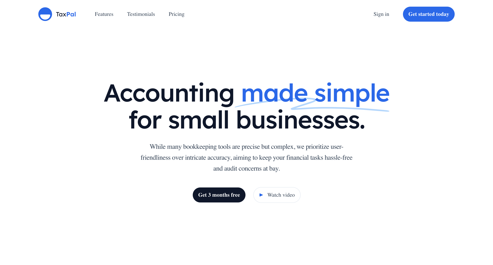

# Taxpal

[](https://taxpal-beta.vercel.app/)

**Taxpal** is a website built with Next.js, designed to simplify accounting for small businesses. Unlike other bookkeeping tools that are precise but complex, Taxpal prioritizes user-friendliness, making financial tasks hassle-free and minimizing audit concerns.

## Features

- **User-Friendly Interface**: Designed with simplicity in mind, Taxpal makes accounting tasks straightforward and stress-free.
- **Simplified Bookkeeping**: Focus on ease of use without sacrificing essential bookkeeping functionalities.
- **User-Friendly Interface**: Inspired by Tailwind UI, the app offers a clean, intuitive, and responsive design.
- **Audit-Ready**: Keep your financial records in order with minimal effort, ensuring you are always prepared for audits.

**Accounting Made Simple for Small Businesses**:
While many bookkeeping tools are precise but complex, we prioritize user-friendliness over intricate accuracy, aiming to keep your financial tasks hassle-free and audit concerns at bay. Taxpal is designed to meet the unique needs of small businesses by simplifying the accounting process.

## Getting Started

### Installation

1. **Clone the repository:**

   ```bash
   git clone https://github.com/your-username/taxpal.git
   cd taxpal
   ```

2. **Install the dependencies:**

   ```bash
   npm install
   ```

3. **Run the development server:**
   ```bash
   npm run dev
   ```
   Open [http://localhost:3000](http://localhost:3000) to view it in the browser. The app will automatically reload if you make edits.

### Contributing

- Fork the repository
- Create a branch
  ```bash
  git checkout -b fix/amazingFix
  ```
- Commit your changes and push to your branch
  ```bash
  git commit -m "made an amazingFix"
  git push origin fix/amazingFix
  ```
- Open a pull request

## License

Distributed under the MIT License. See `LICENSE` for more information.
